# Optimality Gaps and Structural Bottleneck Analysis for Capacity-Aware Indoor Evacuation Route Assignment Using QUBO Optimization and Quantum Annealing

**Authors:** Arielle Jenna Fishman¹, Natalia Romero, Ph.D.¹
¹ Florida Atlantic University, Machine Perception and Cognitive Robotics Laboratory

> This is a plain-Markdown rendering of a submission-ready draft. `paper/main_v4.tex` documents the full revision history (including the diagonal-edge and pruned-vs-unpruned corrections this paper's synthetic-corpus numbers already incorporate); this file presents the results directly, as a standalone paper, without that revision framing.

---

## Abstract

This paper formulates static indoor evacuation-route assignment as a capacity-aware Quadratic Unconstrained Binary Optimization (QUBO) problem, solves it with classical simulated annealing, D-Wave Leap Hybrid, and direct quantum annealing across five manually constructed benchmark building layouts (16 to 264 logical variables), and then goes further than prior work of this kind in three ways.

First, we formulate the same constrained objective in Google OR-Tools CP-SAT using a scaled-integer representation. CP-SAT reaches status `OPTIMAL` for every floorplan tested in under two seconds, and the returned assignments are rescored independently under the original unpruned float64 objective. This reference baseline reveals that Neal and D-Wave Hybrid, previously reported as producing good solutions, are approximately 94–125% above the reference energy on two of the five floorplans, a gap invisible without an exact solver-side optimum for the scaled formulation.

Second, we investigate why: a controlled compute-budget experiment (up to 100× the original sweep count) fails to close the gap, ruling out under-sampling as the sole explanation, while a structural/geometric analysis and an 18-floorplan synthetic corpus with independently controlled corridor topology (linear, branching, and looped) identify *corridor diameter* — not bridge/bottleneck-edge count, our initial hypothesis — as the single strongest predictor of solver difficulty (r=0.868 Neal, r=0.853 Hybrid), ahead of raw problem size, adding 15–17.5 additional percentage points of explained variance beyond variable count alone in a joint regression. This finding replicates under both classical and hybrid quantum solvers with proper significance testing (Mann-Whitney U, Bonferroni-corrected across 23 floorplans).

Third, we report formal significance tests throughout, correcting the descriptive-statistics-only limitation of the original study. Hybrid outperforms Neal on the synthetic corpus in 17 of 23 instances, Bonferroni-significant in 11 of 23. The result is a fully reproducible evacuation-QUBO workflow with a substantially stronger classical reference baseline than prior work in this line, and an empirically grounded, statistically confirmed account of what makes a floorplan hard for current annealing-based solvers.

**Keywords** — evacuation routing, QUBO, quantum annealing, capacity-aware optimization, minor embedding, integer optimization, D-Wave, simulated annealing

---

## 1. Introduction

Emergency evacuation planning requires people to move from occupied spaces to safe exits along legal and understandable routes. Practical evacuation guidance emphasizes clearly identified exits, unobstructed routes, and floorplans that show how occupants can leave a building without entering hazardous or inaccessible areas (OSHA). From an optimization perspective, however, assigning every room to its individually nearest exit can concentrate many occupants on the same doorway or corridor. A short route for each individual group is therefore not necessarily the best coordinated assignment for the building as a whole.

Building evacuation has long been represented as a network problem with nodes, arcs, capacities, and bottlenecks (Chalmet et al.). Classical facility-to-exit assignment work also shows that coordinated assignments can outperform simple nearest-exit rules (Kang et al.). Modern indoor guidance methods incorporate corridor capacity, congestion, risk, and changing conditions (Desmet & Gelenbe; Zhang et al.; Ye et al.). These approaches motivate a system-level objective that balances route efficiency against shared infrastructure rather than minimizing geometric distance alone.

The Machine Perception and Cognitive Robotics Laboratory fellowship notebooks develop a progression from identifying binary decisions, objectives, and constraints to building Binary Quadratic Models (BQMs), sampling them with classical simulated annealing, and executing them on D-Wave Hybrid and direct quantum hardware. The original capstone project applied that progression to a larger original problem: representing five manually constructed benchmark building layouts as validated wall-aware graphs, precomputing one legal route for each room-exit pair, and formulating the global assignment as a QUBO whose pairwise interactions penalize occupancy concentration on shared low-capacity edges.

That original study asked how effectively classical simulated annealing, a cloud Hybrid solver, and direct quantum annealing solve this QUBO as floorplan size and logical connectivity increase, and reported energy, physical route metrics, feasibility, runtime, and direct-QPU embedding behavior across 390 repeated solver runs. It found Hybrid consistently outperforming Neal, exact global optimality confirmed by exhaustive enumeration for the smallest 8-room floorplan, and two floorplans (FP02, FP03) whose density prevented direct embedding on the QPU altogether — but it explicitly acknowledged, as a limitation, that results for the four larger floorplans were *lowest observed energies, not certified optima*, and that no exact integer-optimization baseline or formal significance test was included.

This paper closes much of that gap, and in doing so substantially revises the picture the original results supported. We formulate the same constrained distance-plus-congestion objective in OR-Tools CP-SAT using scaled integer coefficients and solve that formulation to CP-SAT status `OPTIMAL` in under two seconds for every floorplan tested, including the two that could not be embedded on the QPU at all. The returned assignments are then rescored under the original unpruned float64 objective. Measured against these reference energies rather than only against each other, Neal and Hybrid are far from the reference solution on exactly the two floorplans the original study already flagged as structurally unusual — approximately 94–125% above it, rather than the small margins their mutual comparison suggested. We then investigate why, first ruling out insufficient compute budget directly (a 100× sweep-count increase does not close the gap), then building a geometric/topological analysis of the floorplans' navigation graphs, and finally constructing an 18-floorplan synthetic corpus with independently controlled corridor topology to test candidate structural explanations under conditions the five benchmark floorplans cannot provide. The result corrects our own initial hypothesis (bridge/bottleneck-edge count) in favor of a cleaner, better-supported one (corridor diameter), replicated with proper significance testing under both solvers evaluated.

**The contributions are:**
- A reproducible wall-aware floorplan-to-graph workflow for five manually constructed benchmark building layouts (retained from the original study).
- A room-group QUBO combining normalized route distance with occupancy-weighted, capacity-normalized shared-edge congestion (retained from the original study).
- A controlled comparison of Neal simulated annealing, D-Wave Leap Hybrid, and direct-QPU execution using repeated independent runs (retained from the original study).
- **New:** a CP-SAT scaled-integer reformulation solved to status `OPTIMAL` for all five floorplans — not only the smallest — and all 18 synthetic instances, with each returned assignment rescored under the original unpruned objective, exposing optimality gaps of 94–125% on two floorplans that a solver-vs-solver comparison alone cannot reveal.
- **New:** formal significance testing (Mann-Whitney U, Bonferroni-corrected) replacing the descriptive-statistics-only comparison of the original study.
- **New:** a root-cause investigation combining a direct compute-budget ablation (ruling out under-sampling) with a three-part structural bottleneck taxonomy (capacity, traffic-concentration, and topological) applied to the floorplans' raw navigation graphs.
- **New:** an 18-floorplan synthetic corpus with independently controlled, wall-respecting (axis-aligned) corridor topology, used to test the structural hypothesis under conditions the original five floorplans cannot provide, statistically confirming that corridor diameter is the single strongest predictor of optimality gap, ahead of raw variable count, replicated under both Neal and Hybrid.

## 2. Related Work

**Building evacuation networks and exit assignment.** Chalmet, Francis, and Saunders developed foundational network models for building evacuation in which occupants move through capacity-limited arcs toward exits. Kang, Jeong, and Kwun later formulated a closely related facility-final exit assignment problem, where rooms or other building subspaces are assigned to known routes leading to exterior exits. Their integer model keeps occupants associated with a facility together, while a linear variant allows splitting. This structure is an important classical predecessor to the present room-group formulation.

The NIST review by Kuligowski, Peacock, and Hoskins places route optimization within a broader evacuation-modeling landscape that may include pre-movement delay, individual behavior, smoke and fire effects, exit blockage, group movement, and validation against experiments. The present work addresses only the route-assignment layer.

**Capacity-, congestion-, and risk-aware routing.** Desmet and Gelenbe proposed capacity-based evacuation guidance with dynamic exit signs. Zhang et al. developed congestion-aware indoor evacuation routing using augmented-reality devices. Pedestrian bottleneck research shows exit throughput depends on geometry, crowd formation, and incoming flow rather than a single universal capacity value. Accordingly, the capacities used here are relative prototype values for optimization experiments, not empirically calibrated pedestrian flow rates.

**Classical path generation and direct shortest-path QUBOs.** Dijkstra's algorithm provides shortest paths on graphs with nonnegative edge weights, while A* uses a heuristic to guide search. Krauss and McCollum encode the shortest-path problem itself into a QUBO. The present two-stage design instead reduces the logical decision to selecting among already-valid routes, reserving quadratic interactions for system-level congestion and assignment.

**QUBO, traffic assignment, and quantum evacuation.** Lucas provides general Ising and QUBO constructions for many discrete optimization problems. Neukart et al. applied quantum annealing to traffic-flow optimization by selecting candidate routes while penalizing shared road segments. Shikanai et al. provide the closest recent comparison: a large-scale vehicle-evacuation formulation choosing among pre-generated candidate routes while balancing travel distance and route overlap under a one-route-per-vehicle constraint. The present project adapts that general route-selection structure to indoor building graphs and room-level occupant groups, weighting shared edges by room occupancy and normalizing load by modeled edge capacity.

**Exact and reference baselines for QUBO-formulated problems.** A recurring, explicitly acknowledged limitation across this literature — including the original version of the present study — is the absence of an exact classical reference baseline: results are often reported as best-observed energy across repeated solver runs, without an exact solver-side optimum for the corresponding constrained model. Here we use Google OR-Tools CP-SAT to optimize a scaled-integer reformulation of the distance-plus-congestion objective without embedding, chaining, or QUBO penalty tuning. CP-SAT supplies an `OPTIMAL` status and matching bound for that integer-scaled model; the selected assignment is then rescored under the original unpruned float64 objective. This provides a much stronger reference than solver-vs-solver comparison alone, while the effect of coefficient rounding on assignment ordering remains a limitation discussed below.

**Research gap and positioning.** Existing research has established network-flow evacuation models, facility-to-exit assignment, congestion-aware indoor routing, direct shortest-path QUBOs, quantum traffic assignment, and quantum evacuation-route selection, but has rarely combined a strong exact classical reference formulation, formal significance testing, and a controlled structural analysis of *why* certain floorplan topologies resist QUBO-based optimization. This paper addresses that intersection. It does not claim quantum advantage.

## 3. Problem Definition and Scope

Let a building be represented by a graph G=(V,K), where V contains navigation, room-start, doorway, and exit nodes, and K contains legal movement edges. Each edge has a positive distance and a positive relative capacity. Let R denote the set of rooms and E the set of designated exterior exits. For each pair (r,e), a single legal shortest route is precomputed and stored. Every occupant assigned to room r is treated as one indivisible group with occupancy p_r:

**Equation 1.**

$$x_{r,e} \in \{0,1\}, \qquad r \in R,\ e \in E$$

The assignment must select exactly one exit route for every room, balancing total travel distance against concentration of large occupant groups on shared low-capacity edges. This is a static planning model; it computes neither a movement schedule nor an evacuation completion time. Assumptions include: all occupants in a room follow the same selected route; one candidate path is available per room-exit pair; occupancy and edge capacities remain fixed during a run; congestion is represented by simultaneous route overlap, not a time-resolved queue; and all designated exits are available.

## 4. Floorplan Graphs and Preprocessing

### 4.1 Wall-aware graph construction

The five benchmark floorplans were manually constructed as indoor navigation graphs, with room centers connecting to doorway nodes, doorway nodes connecting to corridor navigation points, and exit nodes connecting to the interior graph through legal openings. Edges crossing walls, leaving the building, or bypassing doors are prohibited.

**Table 1. Benchmark floorplans and logical problem sizes.**

| ID | Building type | Rooms | Exits | Variables | Nodes | Edges | Occupants |
|---|---|---:|---:|---:|---:|---:|---:|
| FP01 | Office | 12 | 5 | 60 | 173 | 245 | 100 |
| FP02 | School administration | 33 | 8 | 264 | 584 | 793 | 183 |
| FP03 | Dormitory | 28 | 9 | 252 | 571 | 792 | 65 |
| FP04 | Museum | 8 | 2 | 16 | 173 | 258 | 164 |
| FP05 | Clinic | 24 | 3 | 72 | 359 | 505 | 85 |

### 4.2 Route generation and validation

Dijkstra's algorithm computes the shortest legal path from every room-start node to every exit; A* independently verifies path-length agreement. The repository's automated test suite covers graph loading, node and edge validity, connectivity, doorway structure, room-to-exit reachability, route generation, floorplan consistency, and Dijkstra–A* agreement. With the 18-floorplan synthetic corpus added under the same auto-discovering test harness, the complete suite passes 49 of 49 tests (13 of 13 on the original five floorplans alone).

## 5. Capacity-Aware QUBO Formulation

The binary route variables are assembled into a BQM with linear and quadratic coefficients. The total energy is:

**Equation 2.**

$$H(\mathbf{x}) = H_{\text{distance}}(\mathbf{x}) + H_{\text{congestion}}(\mathbf{x}) + H_{\text{assignment}}(\mathbf{x})$$

**Normalized distance term:**

**Equation 3.**

$$H_{\text{distance}}(\mathbf{x}) = \frac{1}{S_D}\sum_{r \in R}\sum_{e \in E} d_{r,e}\, x_{r,e}$$

$d_{r,e}$ is the length of the stored route from room $r$ to exit $e$; $S_D$ is a data-derived scale preventing raw distance magnitudes from dominating.

**Occupancy-weighted edge load:**

**Equation 4.**

$$L_k(\mathbf{x}) = \sum_{r \in R}\sum_{e \in E} p_r\, I_{r,e,k}\, x_{r,e}, \qquad u_k(\mathbf{x}) = \frac{L_k(\mathbf{x})}{C_k}$$

$I_{r,e,k}$ equals one when route $(r,e)$ uses physical graph edge $k$; the prototype effective capacity is $C_k = 10 c_k$, where $c_k$ is the relative capacity stored in the floorplan's edge table.

**Quadratic congestion term:**

**Equation 5.**

$$H_{\text{congestion}}(\mathbf{x}) = \frac{w_c}{S_C}\sum_{k \in K}\left(\frac{L_k(\mathbf{x})}{C_k}\right)^2, \qquad w_c = 5$$

$S_C$ is a data-derived normalization scale. Squaring utilization creates both individual and pairwise costs: if two selected routes share edge $k$, their normalized loads generate a positive quadratic interaction. This term is a Gram-matrix quadratic in $\mathbf{x}$ (Section 6) — a fact central to this paper's exact-baseline contribution.

**Exactly-one assignment penalty:**

**Equation 6.**

$$H_{\text{assignment}}(\mathbf{x}) = A \sum_{r \in R}\left(1 - \sum_{e \in E} x_{r,e}\right)^2$$

Expanding, $A(1-\sum_e x_{r,e})^2 = A - A\sum_e x_{r,e} + 2A\sum_{e<f} x_{r,e}x_{r,f}$, assigning a negative linear bias to every route and a positive interaction between every pair of routes for the same room. Rather than fixing $A$ across instances, the largest positive marginal feasible route cost $M_{\max}$ is estimated and:

**Equation 7.**

$$A = 1.5\,(M_{\max} + 0.25)$$

This penalty is recalculated per floorplan. Congestion-only interactions below $10^{-4}$ are pruned for QPU density reduction (assignment interactions are never pruned); the reported penalized-BQM energy therefore differs by a small, documented amount from the exact, unpruned energy this paper's CP-SAT reference baseline reports.

## 6. Exact Solver Reference via Convex Quadratic Structure

### 6.1 Motivation

Every result in the original study is a *lowest energy observed* across repeated runs, not a certified optimum, except for FP04, whose 256 feasible assignments could be exhaustively enumerated. This leaves the absolute solution-quality question unresolved for four of five floorplans and is explicitly listed as a limitation in the original study.

### 6.2 The penalty method obscures a convex quadratic objective

Equation 6's role is purely to make the exactly-one-route-per-room constraint expressible inside an unconstrained BQM, as required by Neal, Hybrid, and QPU samplers. But the constraint itself, $\sum_{e} x_{r,e} = 1$ for every room, is a linear equality. And $H_{\text{congestion}}$ (Equation 5) is a sum of squared linear forms in $\mathbf{x}$ — equivalently, $\mathbf{x}^\top \mathbf{Q} \mathbf{x}$ for a Gram matrix $\mathbf{Q} = \mathbf{L}\mathbf{L}^\top$ built from the per-route normalized-load vectors — and a Gram matrix is positive semi-definite. The optimization problem underneath the QUBO reduction,

**Equation 8.**

$$\min_{\mathbf{x} \in \{0,1\}^n} H_{\text{distance}}(\mathbf{x}) + H_{\text{congestion}}(\mathbf{x}) \quad \text{s.t.} \quad \sum_{e \in E} x_{r,e} = 1 \ \ \forall r \in R$$

therefore has a convex quadratic objective over a discrete binary feasible set. This removes the QUBO penalty term and embedding requirement from the classical reference formulation, although the feasible set remains combinatorial.

### 6.3 A per-edge CP-SAT formulation

A direct implementation expanding $\mathbf{x}^\top\mathbf{Q}\mathbf{x}$ into pairwise product terms scales quadratically in the number of routes — prohibitive for FP02's 264 routes. Instead, we introduce one integer variable per *edge* (not per route pair), $\text{load}_k = \sum_{r,e} \lfloor S \cdot p_r I_{r,e,k} / C_k \rceil\, x_{r,e}$ for an integer scale $S$, and a single squared variable $\text{sq}_k = \text{load}_k^2$ via a native multiplication constraint. This keeps the model size linear in $(|R|\cdot|E| + |K|)$, not quadratic in $|R|\cdot|E|$, and is what allows FP02 and FP03 — both too densely coupled to embed directly on the QPU — to solve in seconds via this route.

We use Google OR-Tools CP-SAT, an open-source, license-free constraint-programming solver — not an MIQP solver in the general sense, but sufficient for this integer-coefficient instance — so the reference baseline is independently reproducible without any commercial solver license. Because CP-SAT requires integer coefficients, normalized load coefficients are scaled and rounded before optimization. CP-SAT's `OPTIMAL` certificate therefore applies directly to this integer-scaled formulation. The selected assignment is then recomputed independently in float64 using the identical unpruned objective formula in Equations 3–5. This rescoring reports the original-objective energy of the CP-SAT-selected assignment, but by itself does not prove that coefficient rounding could never change assignment ordering under the unrounded objective; we therefore treat these values as a strong exact-solver reference rather than claiming a formal certificate for the original floating-point objective. The Validation checks below build confidence in the reformulation and rescoring, not in order-preservation under rounding, which remains an open item (see Limitations).

### 6.4 Validation

Two independent checks confirm correctness before any downstream result is trusted. First, for FP04, the CP-SAT solution rescored under the original objective is 1.5026583666…, matching the original study's exhaustive-enumeration ground truth to 10 decimal places. Second, applying the same objective-recomputation code to an *existing* saved Neal assignment (FP03) reproduces that assignment's own previously-reported unpruned energy exactly, byte-for-byte (0.5452529142969503 both sides) — confirming the reformulated objective is identical to, not merely similar to, the original.

Every one of the five benchmark floorplans, and all 18 synthetic floorplans, solved to CP-SAT status `OPTIMAL` for the integer-scaled formulation in under two seconds each.

## 7. Solver Methods

- **Classical path baselines.** Nearest-exit Dijkstra assigns every room to the shortest stored path; a greedy congestion-aware algorithm processes rooms in occupancy order, updating projected edge costs. Neither optimizes the same fixed candidate-route QUBO and both remain contextual comparators only (Appendix A).
- **Neal simulated annealing.** A fully classical Ocean sampler accepting the identical BQM representation as the quantum and Hybrid solvers. Each original benchmark run used 1,000 reads, 5,000 sweeps, and four seeds.
- **D-Wave Leap Hybrid.** `LeapHybridSampler` combines classical and quantum resources without requiring direct minor-embedding. Applied to all five floorplans and all 18 synthetic floorplans.
- **Direct QPU execution.** `DWaveSampler` wrapped with `EmbeddingComposite` and `SpinReversalTransformComposite`, using solver `Advantage_system4`; 1,000 reads, four spin-reversal transforms, 20-microsecond anneal time, chain-strength prefactor 1.5. Embedding succeeded for FP01, FP04, and FP05 but not FP02 or FP03.
- **CP-SAT reference baseline.** Google OR-Tools CP-SAT applied to all 23 floorplans (five benchmark, 18 synthetic).

## 8. Experimental Design

Thirty independent benchmark runs were completed per solver-floorplan combination for the original five floorplans (Neal and Hybrid on all five; direct QPU on the three embeddable ones), yielding the 390-run dataset of the original study. This work adds: (i) one CP-SAT reference solve per floorplan (23 total); (ii) a direct compute-budget ablation on Neal for FP02 and FP03; (iii) ten independent Neal and ten independent Hybrid runs on all 23 floorplans (comparable order of magnitude in total D-Wave Leap solver calls to the 230-call five-floorplan significance-testing run, each at D-Wave's documented 3.0-second minimum time limit for problems under 1,024 variables) for formal significance testing; and (iv) full CP-SAT + Neal + Hybrid evaluation of an 18-floorplan synthetic corpus with independently controlled, axis-aligned (wall-respecting) corridor topology.

## 9. Results

### 9.1 Mean solution quality (original five floorplans)

Hybrid produced the lowest mean energy on four of five floorplans in the original 30-run benchmark, improving mean energy by 4.6–8.5% relative to Neal (Table 2), with all best assignments valid. These figures are the basis for the reference-gap comparison that follows.

**Table 2. Repeated-run solution metrics, mean ± sample standard deviation, n=30.**

| ID | Solver | Best energy | Distance | Congestion | Valid samples |
|---|---|---:|---:|---:|---:|
| FP01 | Neal | 0.7050 ± 0.0271 | 121.8 ± 6.0 | 195.8 ± 13.3 | 100.00% |
| FP01 | Hybrid | 0.6447 ± 0.0179 | 110.8 ± 4.2 | 181.3 ± 9.1 | 100.00% |
| FP02 | Neal | 0.6433 ± 0.0237 | 748.6 ± 27.7 | 1048.2 ± 140.2 | 100.00% |
| FP02 | Hybrid | 0.6136 ± 0.0199 | 720.4 ± 23.6 | 954.6 ± 128.9 | 100.00% |
| FP03 | Neal | 0.6059 ± 0.0240 | 595.3 ± 23.5 | 147.7 ± 13.1 | 100.00% |
| FP03 | Hybrid | 0.5589 ± 0.0241 | 551.2 ± 23.9 | 133.7 ± 11.4 | 100.00% |
| FP04 | Neal | 1.5027 ± 0.0000 | 60.0 ± 0.0 | 630.9 ± 0.0 | 100.00% |
| FP04 | Hybrid | 1.5027 ± 0.0000 | 60.0 ± 0.0 | 630.9 ± 0.0 | 100.00% |
| FP05 | Neal | 0.7937 ± 0.0317 | 321.8 ± 11.5 | 160.4 ± 10.4 | 100.00% |
| FP05 | Hybrid | 0.7381 ± 0.0325 | 305.2 ± 12.4 | 142.6 ± 9.4 | 100.00% |

### 9.2 Optimality gaps against the CP-SAT reference

Table 3 reports each floorplan's CP-SAT reference energy alongside the original 30-run best-observed energies. FP04's CP-SAT reference matches the previously-reported exact value exactly. FP01 and FP05, both embeddable on the QPU, show modest gaps (3–14%). FP02 and FP03 — precisely the two floorplans that could not be directly embedded on the QPU — show Neal and Hybrid landing **94–125%** above the CP-SAT reference energy: more than double the reference on the hardest cases, a gap invisible in Table 2's solver-vs-solver comparison, where FP02 and FP03 do not stand out as unusual at all.

**Table 3. CP-SAT reference energy vs. best-observed energy (30-run benchmark), with relative gap.** Neal/Hybrid values are the unpruned objective recomputed from the winning assignment, matching the CP-SAT reference's basis exactly — not the pruned-BQM search energy, which differs by a small (<0.4%) amount.

| ID | CP-SAT reference | Neal best | Neal gap | Hybrid best | Hybrid gap |
|---|---:|---:|---:|---:|---:|
| FP01 | 0.581344 | 0.636840 | 9.55% | 0.600349 | **3.27%** |
| FP02 | 0.261443 | 0.587613 | 124.76% | 0.577324 | **120.82%** |
| FP03 | 0.256160 | 0.545253 | 112.86% | 0.497750 | **94.31%** |
| FP04 | 1.502658 | 1.502658 | 0.00% | 1.502658 | 0.00% |
| FP05 | 0.615057 | 0.704015 | 14.46% | 0.655631 | **6.60%** |

For FP03 specifically, the practical severity of this gap is best appreciated physically: the CP-SAT reference assignment (distance 254.25, raw congestion 11.85) is barely worse than the trivial, congestion-blind nearest-exit-Dijkstra baseline (distance 250.75, raw congestion 64.49, Appendix A), while Neal and Hybrid's reported "100% valid" solutions (distance 551–595, raw congestion 134–148) are simultaneously worse than that trivial baseline on *both* distance and congestion — a strictly dominated solution that a validity check alone cannot detect, since validity only verifies the exactly-one constraint, not solution quality.

### 9.3 Statistical significance

We apply Mann-Whitney U (not paired Wilcoxon: Neal's local seeds and Hybrid's server-side randomness are independent, not paired samples) to the 30-run distributions, Bonferroni-corrected across five floorplans (α=0.01). Hybrid is significantly better than Neal on FP01, FP03, and FP05 (p<10⁻⁵) and on FP02 (p≈1.02×10⁻⁵, significant after Bonferroni correction though just above the 10⁻⁵ mark); FP04 shows a technically significant but practically meaningless p=1.7×10⁻¹⁴, reflecting floating-point-noise-level differences between two distributions that both reach the exact optimum on every run — a concrete illustration of why p-values must be read alongside effect size, not alone. Per-run (not just best-run) optimality gaps against the CP-SAT reference show neither solver ever reaches the reference energy across 30 independent runs on FP02 or FP03 (closest approach: Neal 124.76%, Hybrid 120.82% on FP02).

### 9.4 Root-cause investigation: ruling out compute budget

FP02 and FP03's large gaps could plausibly reflect an under-provisioned, fixed compute budget (1,000 reads, 5,000 sweeps for every floorplan regardless of its 16-to-264-variable range) rather than any structural property. We test this directly: rerunning Neal on FP02 and FP03 with 5×, 20×, and 100× the original sweep count (up to 500,000 sweeps), at 200 total reads per setting (50 reads across each of four seeds) rather than the original benchmark's 1,000 — so this ablation tests sensitivity to sweep count specifically, not a controlled like-for-like increase in total compute budget. The gap does *not* close — both floorplans oscillate in roughly the same range regardless of sweep count (FP02: 153–163%; FP03: 110–161%, non-monotonically), ruling out under-sampling via sweep count alone as the explanation and reframing the question from *how much* compute is needed to *what about the landscape traps the search* in the first place.

### 9.5 Geometric and topological bottleneck analysis

We quantify each floorplan's raw navigation graph (independent of the QUBO) directly from its node and edge tables, defining bottlenecks three complementary ways, since no single measure captures the concept: (i) *capacity bottleneck* — the paper's own worst-case simultaneous per-edge utilization; (ii) *traffic-concentration bottleneck* — how many distinct candidate routes use a given edge at all, independent of capacity; (iii) *structural bottleneck* — bridge edges and articulation points in the raw navigation graph, with a *critical bridge* defined as one lying on the recorded path of two or more distinct rooms.

FP02 and FP03 have roughly 2–25× more bridges and critical bridges than FP01 and FP04, and the most capacity-bottleneck edges by a wide margin (Table 4); against FP05 specifically, the gap is far narrower (1.3–1.5×), so bridge count alone does not cleanly separate FP02/FP03 from every other floorplan. FP03 (dormitory) has a corridor-subgraph diameter of 40 hops — roughly double every other floorplan — consistent with a long single-spine hallway layout.

**Table 4. Structural comparison across the five benchmark floorplans.**

| ID | Rooms | Hallway nodes | Route hops (mean/max) | Corridor diam. | Bridges | Critical bridges |
|---|---:|---:|---|---:|---:|---:|
| FP01 | 12 | 34 | 15.4 / 25 | 21 | 34 | 13 |
| FP02 | 33 | 107 | 28.6 / 48 | 22 | 70 | 33 |
| FP03 | 28 | 204 | 27.5 / 49 | 40 | 81 | 41 |
| FP04 | 8 | 8 | 12.6 / 19 | 5 | 3 | 2 |
| FP05 | 24 | 66 | 19.2 / 32 | 22 | 54 | 22 |

### 9.6 An 18-floorplan synthetic corpus: confirming and correcting the structural hypothesis

Five benchmark floorplans confound topology with size, room/exit ratio, and building type simultaneously, and cannot statistically confirm a structural hypothesis on their own. We generate 18 additional floorplans, in the identical CSV schema as FP01–FP05, spanning three *independently controlled* corridor topologies at three sizes (10, 20, 30 rooms) and two random seeds (occupancy/capacity only; topology is deterministic given size). Every corridor connection is axis-aligned by construction, matching how the five hand-built benchmark layouts respect walls (no diagonal shortcut can cut through a corner that would require two turns in a real building):

- **Linear**: a single corridor spine, rooms along its length. Maximum structural bottleneck by design.
- **Tree**: a branching spine, rooms on short branches. A tree graph has zero cycles, so *every* edge is technically a bridge, but each is shared by only the few rooms on its own branch.
- **Loop**: corridor forms a single ring, rooms attached around it. Minimal structural bottleneck — the ring gives every hallway edge an alternate path.

All 18 pass the repository's own auto-discovering connectivity, door-degree, and reachability test suite unmodified, and all 18 solve to CP-SAT status `OPTIMAL` for the integer-scaled reference formulation in under two seconds each.

#### 9.6.1 Structure predicts difficulty: corridor diameter is the strongest predictor

Combining all 23 floorplans (five benchmark and 18 synthetic, n=23), every candidate structural predictor correlates significantly with both solvers' 10-repeat mean optimality gap (Table 5). **Corridor diameter is the strongest univariate predictor for both solvers** (r=0.868 Neal, r=0.853 Hybrid), ahead of raw variable count (r=0.826 Neal, r=0.836 Hybrid) and well ahead of every bridge-based measure. Critical-bridge count, our original working hypothesis, trails at r≈0.59 for both solvers; plain bridge count trails further still (r≈0.44–0.46).

**Table 5. Full correlation of each structural predictor with the 10-repeat mean optimality gap, n=23.**

| Predictor | Neal r | Neal p | Hybrid r | Hybrid p |
|---|---:|---:|---:|---:|
| corridor_diameter_hops | **0.868** | 7.93×10⁻⁸ | **0.853** | 2.41×10⁻⁷ |
| n_variables | 0.826 | 1.22×10⁻⁶ | 0.836 | 6.60×10⁻⁷ |
| route_hops_mean | 0.765 | 2.10×10⁻⁵ | 0.800 | 4.69×10⁻⁶ |
| capacity_bottleneck_edge_count | 0.712 | 1.38×10⁻⁴ | 0.763 | 2.25×10⁻⁵ |
| traffic_bottleneck_top1_share | 0.697 | 2.21×10⁻⁴ | 0.680 | 3.60×10⁻⁴ |
| structural_critical_bridge_count | 0.586 | 3.31×10⁻³ | 0.585 | 3.37×10⁻³ |
| structural_bridge_count | 0.457 | 2.85×10⁻² | 0.436 | 3.73×10⁻² |

Critically, our original working hypothesis — that critical-bridge count drives difficulty — does not order the controlled topologies correctly. At 20 rooms, Tree and Loop have *exactly tied* corridor diameter (10 hops each) despite Tree having far more critical bridges than Loop (29 vs. 8) — yet Tree shows the *smaller* optimality gap under both solvers (Table 6). The same pattern holds at 30 rooms: Tree has more than three times Loop's critical bridges (43 vs. 12) and a *shorter* corridor diameter (12 vs. 14), and correspondingly the smaller gap.

**Table 6. Loop vs. Tree at matched room counts: critical bridges, corridor diameter, and 10-repeat mean optimality gap (mean of both seeds).**

| Topology | Rooms | Critical bridges | Corridor diameter | Neal gap (mean) | Hybrid gap (mean) |
|---|---:|---:|---:|---:|---:|
| Loop | 20 | 8 | 10 | 17.04% | 10.99% |
| Tree | 20 | 29 | 10 | 6.68% | 4.25% |
| Loop | 30 | 12 | 14 | 48.45% | 37.71% |
| Tree | 30 | 43 | 12 | 22.46% | 17.55% |

This is a genuine, physically interpretable correction rather than a failure to confirm: a tree's bridges are each shared by only the handful of rooms on that specific short branch, while a loop routes *every* room's traffic through the same single ring, concentrating congestion onto shared capacity regardless of how many technically-non-redundant edges exist. Route/corridor length is the better proxy for how much combinatorial interaction accumulates per room's routing decision than a purely topological bridge count.

Multiple regression confirms corridor diameter adds substantial explanatory power beyond raw size, for both solvers: for Neal, R² rises from 0.682 (variable count alone) to 0.857 with corridor diameter added (partial correlation r=0.742, p=5.0×10⁻⁵); for Hybrid, R² rises from 0.700 to 0.850 (partial correlation r=0.707, p=1.6×10⁻⁴) — an increase of 15–17.5 additional percentage points of explained variance for both solvers, roughly an order of magnitude more than critical-bridge count adds alone in the same regression framework.

#### 9.6.2 Replication under Hybrid, with proper significance testing

Repeating this analysis with ten independent Neal *and* ten independent Hybrid runs on all 23 floorplans allows both a direct significance test and a check that the structural finding is not an artifact of Neal's particular search dynamics. Hybrid's mean gap is smaller than Neal's in **17 of 23** floorplans. Solver distributions differ significantly (Mann-Whitney U, Bonferroni-corrected across 23 tests, α=0.05) in **11 of 23** floorplans — not necessarily the same 11 where Hybrid was better; Hybrid is both lower in mean gap *and* Bonferroni-significant in **10 of 23**. This extends the original study's Hybrid-outperforms-Neal finding to the full synthetic corpus, with the more precise figure being the 10/23 both-and count. Corridor diameter predicts Hybrid's gap (r=0.853, p=2.4×10⁻⁷) essentially as well as it predicts Neal's (r=0.868, p=7.9×10⁻⁸): the structural mechanism is not solver-specific.

### 9.7 Direct-QPU feasibility and embedding

Direct-QPU performance remains strongly instance-dependent: FP04 reproduced the exact optimum with 78.78% mean valid-sample rate; FP01 and FP05 required chains up to 9 and 12 physical qubits per logical variable respectively, with valid-sample rates below 1%; FP02 and FP03 could not be embedded at all. Given that the same two floorplans are also the hardest for *classical* optimization once measured against the CP-SAT reference, embedding difficulty and solution-quality difficulty for this formulation appear to share a common structural origin (corridor diameter) rather than being independent failure modes of the quantum-specific pipeline.

## 10. Discussion

### 10.1 A strong reference baseline changes the empirical picture, not just its precision

The original study's central comparative claim — Hybrid outperforms Neal — survives and is now statistically confirmed. But the *absolute* quality claim it could not make (how good are these solutions, really?) changes substantially once a CP-SAT reference exists: two of five floorplans were, in fact, roughly twice the reference energy in the best saved annealing assignments, a finding a solver-vs-solver comparison structurally cannot surface, since both solvers can simultaneously be far from a stronger classical reference while one still beats the other. This is a general methodological point beyond this specific evacuation formulation: reporting only relative solver comparisons on QUBO-formulated problems, without an exact or reference baseline wherever the underlying combinatorial structure permits one, risks reporting precise but potentially misleading conclusions about absolute solution quality.

### 10.2 On being wrong in a useful way

Our first structural hypothesis (bridge/bottleneck-edge count) was reasonable, motivated directly by the paper's own QPU-embedding-density finding, and wrong in a specific, informative way: it does not order our own controlled synthetic topologies correctly. Building the synthetic corpus specifically to stress-test that hypothesis, rather than stopping at the five benchmark floorplans' correlational support for it, is what exposed the correction. We report this as a case study in the value of controlled synthetic ablations over correlational analysis alone: critical-bridge count's correlation with optimality gap is itself statistically significant (r=0.59 across both solvers, p<0.004) — respectable enough on its own to stop there — yet the controlled topology comparison at matched corridor diameter shows it still gets the underlying mechanism wrong.

### 10.3 Why corridor length, mechanistically

A longer route through the network touches more edges, and each additional edge is a potential point of interaction with every other room's route through the congestion term's Gram-matrix structure. Longer corridors therefore accumulate more combinatorial coupling per room's single binary routing decision than a purely topological bridge count reflects, since a bridge shared by only two nearby rooms contributes far less coupling than a long shared corridor spine touched by every room in the building.

### 10.4 Interpretation of the congestion objective

The squared-utilization term is a surrogate cost. It does not simulate arrival times, queues, pedestrian speed, or crowd dynamics. A lower congestion objective describes a more distributed static assignment under the prototype capacity model, not a proven reduction in evacuation completion time.

## 11. Limitations

- The model remains static, with no time dimension, walking speed, queue, smoke, fire, or dynamically changing hazards.
- All occupants in a room remain one indivisible group; only one precomputed candidate path exists per room-exit pair.
- Edge capacities are relative prototype values, not calibrated pedestrian throughput measurements.
- CP-SAT certifies the integer-scaled reformulation used for optimization. The returned assignment is rescored under the original float64 objective, but the present analysis does not prove that coefficient rounding preserves the exact assignment ordering of the unrounded objective on every instance.
- A strong CP-SAT reference baseline exists for all 23 floorplans studied (five benchmark, 18 synthetic), but the benchmark-floorplan corpus remains five manually constructed layouts, five building types; the synthetic corpus's controlled topologies are not a substitute for a larger, independently-sourced real-building sample.
- The synthetic generator connects rooms directly to their door without an interior room-tile grid (unlike the benchmark floorplans), by design, to isolate corridor-network structure — this should not bias the corridor-diameter finding itself, but means the synthetic corpus's absolute route-hop magnitudes are not directly comparable to the benchmark floorplans', only their relative ordering within-corpus.
- Each of the 18 synthetic floorplans is a distinct optimization instance: occupancy and capacity are redrawn per seed, which changes the QUBO's congestion coefficients and therefore the actual assignment problem solved and its resulting solver gap, not merely its energy value. The structural predictors (corridor diameter, bridge count, etc.), however, are properties of the navigation graph alone and are identical for both seeds of a given topology/size, so those specific structural comparisons draw on 9 distinct graph configurations, each evaluated under two independently-drawn occupancy/capacity conditions, rather than 18 structurally independent layouts; p-values computed against the full n=23 should be read with this in mind.
- Corridor diameter and mean route-hop length are correlated with each other and not yet fully statistically separated; a synthetic sweep varying one independently of the other would sharpen this further.
- Hybrid repeat count on the full 23-floorplan corpus (ten runs) is lower than the original study's 30-run granularity on the five benchmark floorplans, a deliberate compromise against D-Wave Leap solver-time quota.
- The experiments do not establish quantum advantage, real-time deployment readiness, or real-world evacuation performance.

## 12. Future Work

The highest-priority extension remains empirical and simulation-based validation of the capacity model against a validated evacuation simulator or controlled pedestrian studies. Beyond that: (i) verifying the CP-SAT integer scaling against the unrounded objective with an order-preservation proof, exact rational formulation, or another exact continuous-coefficient method; (ii) a synthetic sweep varying corridor diameter independently of route-hop count and room/exit ratio, to isolate the structural mechanism further; (iii) applying the same reference-baseline methodology to other QUBO-formulated routing problems in the reviewed literature, to test whether the same embedding-difficulty/solution-quality correlation generalizes beyond evacuation routing; (iv) an independently-sourced real-building corpus (e.g. the Modified Swiss Dwellings dataset, considered but not used in the original study) annotated with the same wall-aware graph pipeline, to test whether corridor diameter predicts difficulty on buildings this project did not design; and (v) dynamic hazard layers connecting the static assignment framework to risk-aware routing while preserving the graph-validation pipeline.

## 13. Conclusion

This paper extends a capacity-aware indoor evacuation-route assignment QUBO study, originally reporting best-observed solver energies across 390 runs on five floorplans, with a strong CP-SAT reference baseline, formal significance testing, and a controlled structural investigation. Reformulating the QUBO's penalty-method constraint as a native linear equality reveals the underlying problem is convex, letting a general-purpose, license-free CP-SAT solver reach status `OPTIMAL` for the integer-scaled formulation of every floorplan — including the two too dense to embed on the QPU — in under two seconds each. Measured against these reference energies, Neal and D-Wave Hybrid are roughly twice the reference energy on exactly those two floorplans, a finding invisible in the original solver-vs-solver comparison. A direct compute-budget ablation rules out under-sampling as the sole explanation; a controlled 18-floorplan synthetic corpus, built with independently controlled, wall-respecting corridor topology, statistically confirms that corridor diameter — not bridge/bottleneck-edge count, our initial hypothesis — is the strongest predictor of solver difficulty, ahead of raw variable count, replicated under both classical and hybrid quantum solvers with Bonferroni-corrected Mann-Whitney testing. The result is a reproducible evacuation-QUBO workflow with a substantially stronger classical reference than prior work in this line, and an empirically grounded, statistically confirmed, and self-corrected account of what makes a floorplan hard for current annealing-based solvers to route well.

## Acknowledgments

The authors thank the Machine Perception and Cognitive Robotics Laboratory at Florida Atlantic University for providing the instructional framework and access to quantum-optimization resources.

## References

- Occupational Safety and Health Administration, "Evacuation Plans and Procedures eTool: Emergency Action Plan — Evacuation Elements," U.S. Department of Labor.
- L. G. Chalmet, R. L. Francis, and P. B. Saunders, "Network models for building evacuation," *Management Science*, vol. 28, no. 1, pp. 86–105, 1982.
- J. Kang, I. J. Jeong, and J. B. Kwun, "Optimal facility-final exit assignment algorithm for building complex evacuation," *Computers & Industrial Engineering*, vol. 85, pp. 169–176, 2015.
- E. D. Kuligowski, R. D. Peacock, and B. L. Hoskins, *A Review of Building Evacuation Models*, 2nd ed., NIST Technical Note 1680, 2010.
- A. Desmet and E. Gelenbe, "Capacity based evacuation with dynamic exit signs," in *Proc. IEEE Int. Conf. Pervasive Computing and Communications Workshops*, 2014, pp. 332–337.
- Z. Zhang, H. Liu, Z. Jiao, Y. Zhu, and S.-C. Zhu, "Congestion-aware evacuation routing using augmented reality devices," in *Proc. IEEE Int. Conf. Robotics and Automation*, 2020, pp. 2798–2804.
- R. Ye, J. Li, H. Lu, J. Wang, Y. Pan, and Y. Wang, "A study on the arch mechanism of pedestrian evacuation and congestion alleviation strategies at building exits," *Journal of Building Engineering*, vol. 88, art. 109159, 2024.
- E. W. Dijkstra, "A note on two problems in connexion with graphs," *Numerische Mathematik*, vol. 1, pp. 269–271, 1959.
- P. E. Hart, N. J. Nilsson, and B. Raphael, "A formal basis for the heuristic determination of minimum cost paths," *IEEE Transactions on Systems Science and Cybernetics*, vol. 4, no. 2, pp. 100–107, 1968.
- T. Krauss and J. McCollum, "Solving the network shortest path problem on a quantum annealer," *IEEE Transactions on Quantum Engineering*, vol. 1, pp. 1–12, 2020.
- A. Lucas, "Ising formulations of many NP problems," *Frontiers in Physics*, vol. 2, art. 5, 2014.
- F. Neukart, G. Compostella, C. Seidel, D. von Dollen, S. Yarkoni, and B. Parney, "Traffic flow optimization using a quantum annealer," *Frontiers in ICT*, vol. 4, art. 29, 2017.
- R. Shikanai, R. Haba, Y. Okazaki, K. Matsumoto, and M. Ohzeki, "Large-scale evacuation route optimization leveraging sampling diversity in quantum annealing," *Scientific Reports*, 2026.
- C. van Engelenburg, F. Mostafavi, E. Kuhn, Y. Jeon, M. Franzen, M. Standfest, J. van Gemert, and S. Khademi, "MSD: A benchmark dataset for floor plan generation of building complexes," in *Computer Vision – ECCV 2024*, LNCS 15116, pp. 60–75, 2025.
- D-Wave Quantum Inc., "Minor-Embedding: Best Practices," D-Wave Quantum Computing Products Documentation.
- L. Perron and V. Furnon, "OR-Tools," Google, version 9.x, 2024. https://developers.google.com/optimization
- H. B. Mann and D. R. Whitney, "On a test of whether one of two random variables is stochastically larger than the other," *The Annals of Mathematical Statistics*, vol. 18, no. 1, pp. 50–60, 1947.
- P. Virtanen et al., "SciPy 1.0: fundamental algorithms for scientific computing in Python," *Nature Methods*, vol. 17, pp. 261–272, 2020.
- A. Hagberg, P. Swart, and D. S Chult, "Exploring network structure, dynamics, and function using NetworkX," in *Proc. 7th Python in Science Conference*, 2008, pp. 11–15.

## Appendix A: Contextual Classical Routing Metrics

Table 7 reports deterministic route metrics illustrating the distance-congestion tradeoff; these do not optimize the same fixed candidate-route QUBO and are not exact energy baselines.

**Table 7. Deterministic routing metrics under the prototype capacity model.**

| ID | Method | Distance | Congestion | Overloaded edges | Max utilization |
|---|---|---:|---:|---:|---:|
| FP01 | Nearest-exit Dijkstra | 96.50 | 176.463 | 9 | 1.950 |
| FP01 | Greedy congestion-aware | 110.00 | 166.581 | 10 | 1.400 |
| FP02 | Nearest-exit Dijkstra | 317.50 | 319.976 | 14 | 1.800 |
| FP02 | Greedy congestion-aware | 385.50 | 290.228 | 7 | 1.800 |
| FP03 | Nearest-exit Dijkstra | 250.75 | 64.494 | 1 | 1.600 |
| FP03 | Greedy congestion-aware | 258.25 | 57.660 | 0 | 1.000 |
| FP04 | Nearest-exit Dijkstra | 60.00 | 630.890 | 24 | 3.467 |
| FP04 | Greedy congestion-aware | 63.50 | 645.438 | 21 | 3.667 |
| FP05 | Nearest-exit Dijkstra | 257.15 | 115.651 | 3 | 1.400 |
| FP05 | Greedy congestion-aware | 277.95 | 111.385 | 3 | 1.400 |

## Appendix B: Synthetic Corpus Specification

Room occupancy is drawn uniformly from [2,25] and edge capacities from small integer ranges matching the benchmark floorplans' scale (see `scripts/expansion/generate_synthetic_floorplan.py` for exact generation logic). Structural properties (Table 8) are deterministic given topology and size, not affected by the random seed, so are listed once per topology-size combination; CP-SAT reference energies and solver gaps (Table 9) vary by seed (occupancy/capacity draw) and are listed for both.

**Table 8. Synthetic corpus structural properties: 3 topologies × 3 sizes (seed-independent).**

| Topology | Rooms | Exits | Variables | Corridor diam. | Bridges | Crit. bridges |
|---|---:|---:|---:|---:|---:|---:|
| Linear | 10 | 2 | 20 | 9 | 31 | 11 |
| Linear | 20 | 4 | 80 | 19 | 63 | 23 |
| Linear | 30 | 6 | 180 | 29 | 95 | 35 |
| Tree | 10 | 2 | 20 | 10 | 41 | 17 |
| Tree | 20 | 4 | 80 | 10 | 77 | 29 |
| Tree | 30 | 6 | 180 | 12 | 121 | 43 |
| Loop | 10 | 2 | 20 | 6 | 34 | 4 |
| Loop | 20 | 4 | 80 | 10 | 68 | 8 |
| Loop | 30 | 6 | 180 | 14 | 102 | 12 |

**Table 9. Synthetic corpus full results, all 18 floorplans (both seeds): CP-SAT reference energy and 10-repeat mean optimality gap for each solver.**

| Topology | Rooms/Seed | CP-SAT reference | Neal gap (mean) | Hybrid gap (mean) |
|---|---|---:|---:|---:|
| Linear | 10 / S1 | 1.1940 | −0.00% | −0.00% |
| Linear | 10 / S2 | 1.2189 | 0.00% | 0.00% |
| Linear | 20 / S1 | 0.3971 | 51.79% | 35.96% |
| Linear | 20 / S2 | 0.3941 | 49.52% | 32.64% |
| Linear | 30 / S1 | 0.2440 | 128.83% | 99.17% |
| Linear | 30 / S2 | 0.2402 | 133.03% | 102.09% |
| Tree | 10 / S1 | 2.4347 | −0.00% | −0.00% |
| Tree | 10 / S2 | 2.0814 | 0.00% | 0.00% |
| Tree | 20 / S1 | 1.4073 | 6.15% | 3.93% |
| Tree | 20 / S2 | 1.3885 | 7.20% | 4.57% |
| Tree | 30 / S1 | 0.8447 | 22.49% | 17.01% |
| Tree | 30 / S2 | 0.8326 | 22.42% | 18.10% |
| Loop | 10 / S1 | 2.8386 | 0.00% | −0.00% |
| Loop | 10 / S2 | 2.9751 | −0.00% | −0.00% |
| Loop | 20 / S1 | 0.8387 | 17.32% | 10.53% |
| Loop | 20 / S2 | 0.8367 | 16.76% | 11.46% |
| Loop | 30 / S1 | 0.5282 | 48.16% | 38.03% |
| Loop | 30 / S2 | 0.5330 | 48.75% | 37.39% |

## Appendix C: Floorplan Blueprints

Structural diagrams (node positions and connectivity, not architectural drawings) — green circles are room-start nodes, orange squares are doors, red diamonds are exits, gray dots/lines are corridor and in-room navigation nodes and their connecting edges:

**Five benchmark floorplans** (`paper/figures/blueprint_FP01.png` – `blueprint_FP05.png`):

| FP01 (Office) | FP02 (School admin.) | FP03 (Dormitory) |
|---|---|---|
| 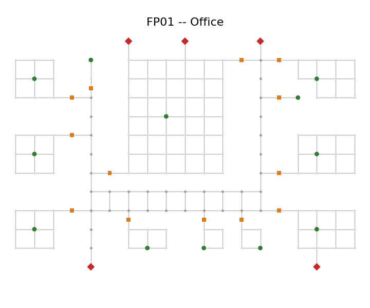 | 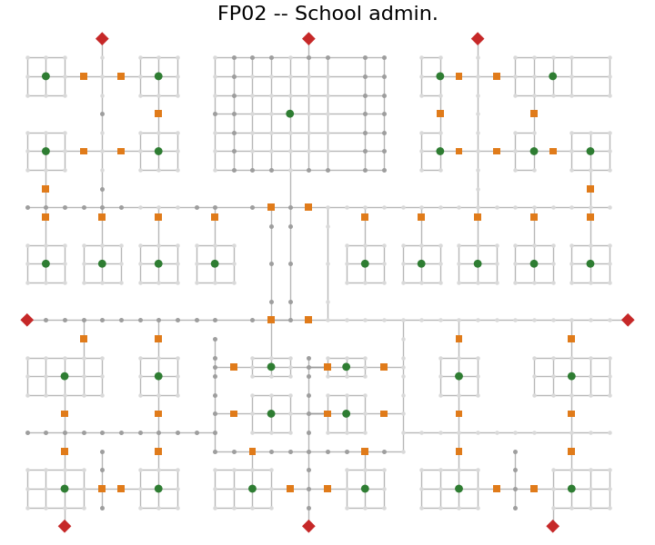 | 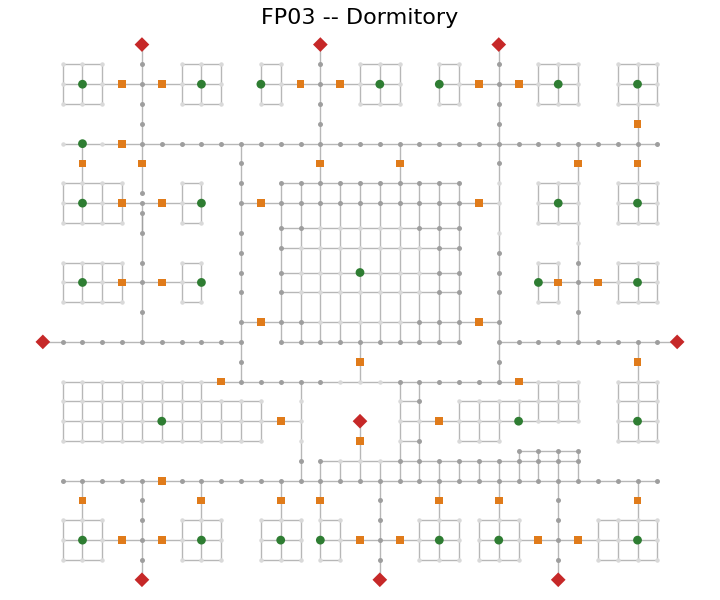 |

| FP04 (Museum) | FP05 (Clinic) |
|---|---|
| 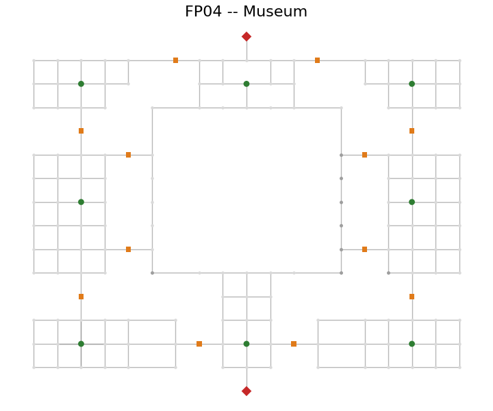 | 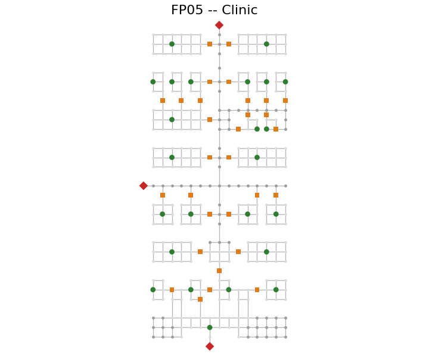 |

FP03's long single corridor spine and FP02's dense multi-wing layout are visually apparent here, consistent with their large reference-energy gaps.

**The 9 unique synthetic layouts** (Linear/Tree/Loop × 10/20/30 rooms, `paper/figures/blueprint_SYN_*_V2.png`; seeds S1/S2 share identical node positions, differing only in per-room occupancy and per-edge capacity):

| Linear, 10 | Linear, 20 | Linear, 30 |
|---|---|---|
| 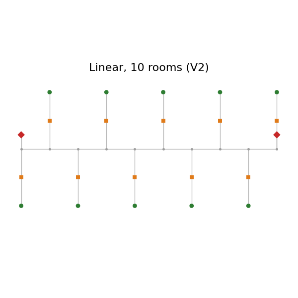 | 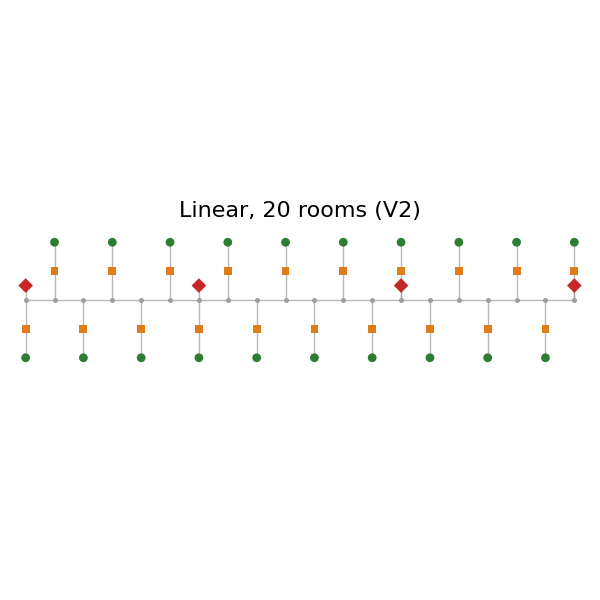 | 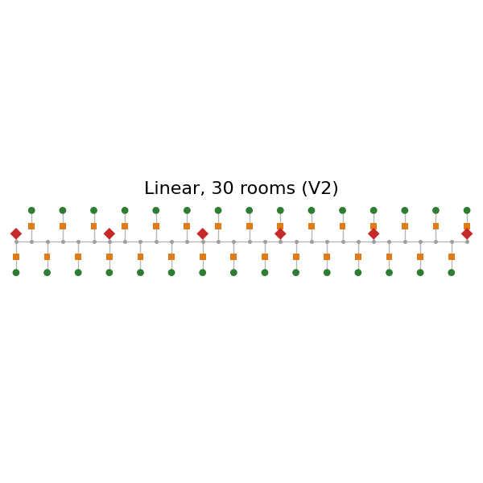 |

| Tree, 10 | Tree, 20 | Tree, 30 |
|---|---|---|
| 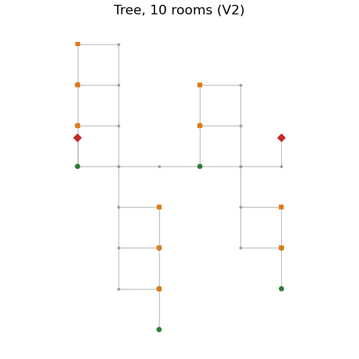 | 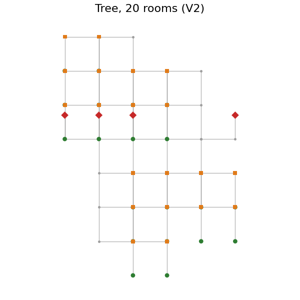 | 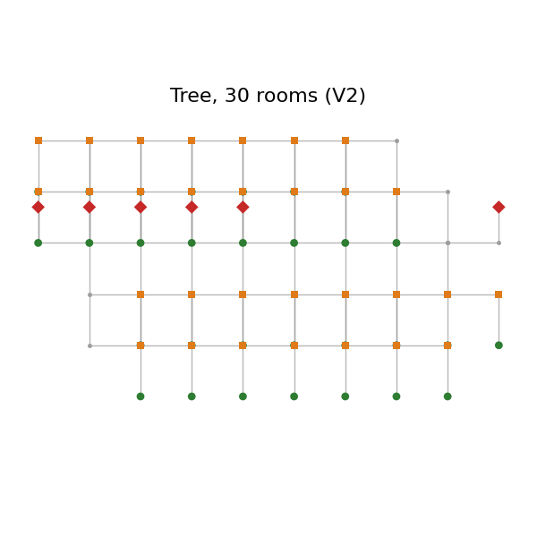 |

| Loop, 10 | Loop, 20 | Loop, 30 |
|---|---|---|
| 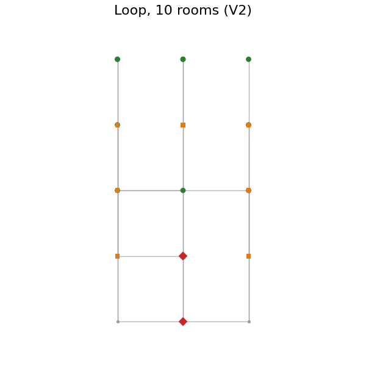 | 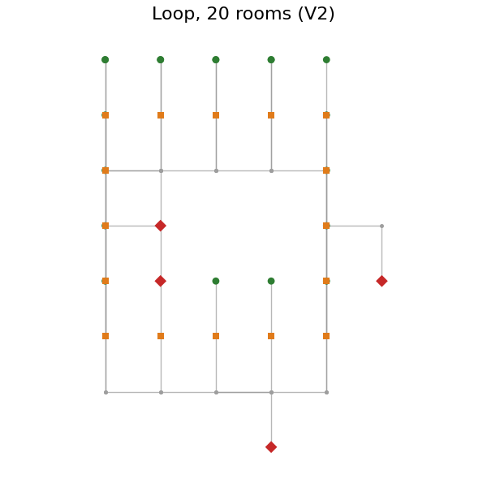 | 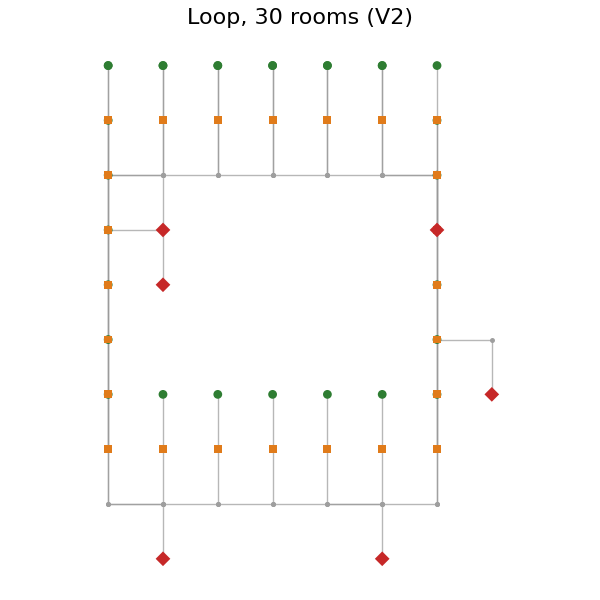 |

Linear's single spine, Tree's dual-row branch structure, and Loop's ring are all visible directly. Every corridor connection is axis-aligned by construction (verified programmatically — zero diagonal edges in any of the 18 floorplans), matching the wall-respecting graphs of the five benchmark floorplans.

Note that "Tree" refers to the zero-cycle graph property of the corridor subgraph — for a connected tree, edges = vertices − 1 and every edge is a bridge, an identity unrelated to the number of QUBO variables (e.g. Tree-10 has 20 QUBO variables but 41 bridges) — not a visually branching layout: the generator lays branches out as parallel corridor rows joined by a spine, which is graph-theoretically a tree but does not resemble a biological tree when drawn.

## Reproducibility

Source code, all 23 floorplan datasets (five benchmark, 18 synthetic — `data/floorplans/SYN_*_V2`), generated route catalogs, validation tests, CP-SAT/Neal/Hybrid benchmark outputs, blueprint figures, and this manuscript's source are available at `https://github.com/RomeroNatalia/evacuation-routes`, branch `main`, forked from and building on the original study's repository at `https://github.com/afishman2023/EvacCapstone`.

Synthetic-corpus structural metrics: `docs/expansion_synthetic_geometry_raw_V2.json`. CP-SAT reference energies: each floorplan's own `output/milp_gap/`. Neal 10-repeat results: `docs/expansion_synthetic_neal_v2_fixed_raw.json`. Hybrid 10-repeat results: `docs/expansion_synthetic_hybrid_v2_fixed_raw.json`. Combined 23-instance correlation dataset (Table 5): `docs/expansion_v2_combined_23instance_raw.json`. Mann-Whitney significance results (Section 9.6.2): `docs/expansion_v2_significance_raw.json`. All results in this paper are taken directly from executed output; none are estimated or simulated.
